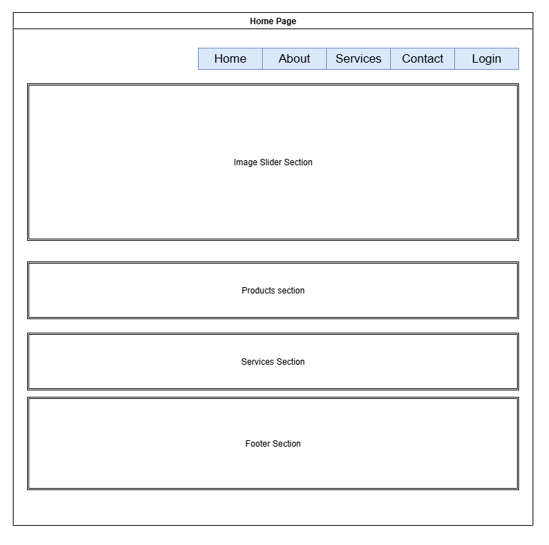
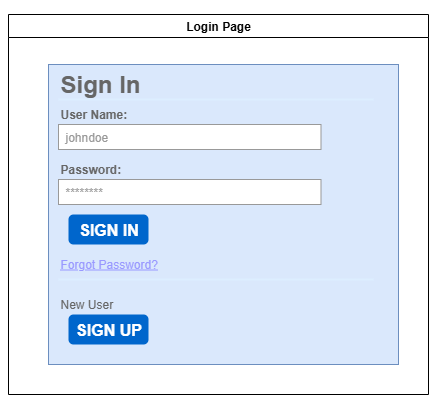
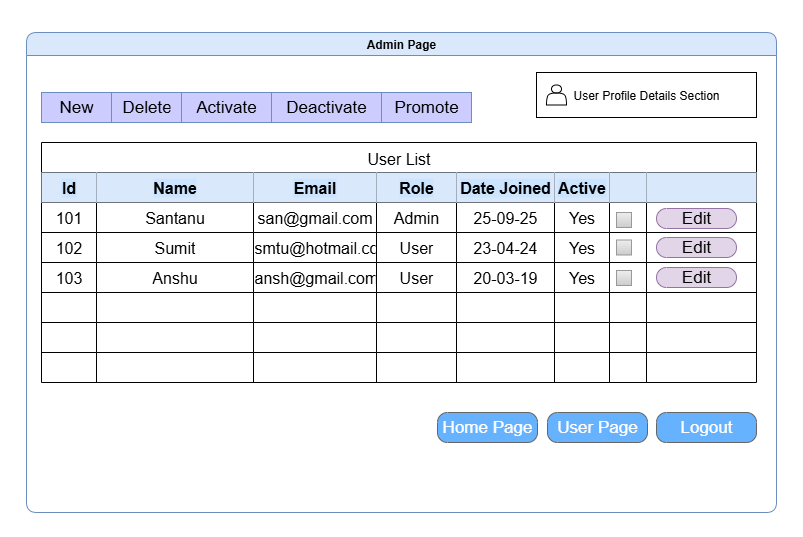
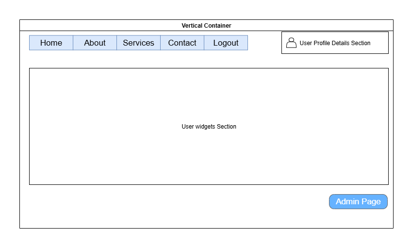

###The objective : To create a system in php with model-view-controller mechanism 


You are an expert PHP engineer. Build a minimal, clean PHP 8 MVC app that implements a small admin system with authentication, user self‑service, and an admin dashboard for user management. Follow the exact structure, file names, routes, and behaviors described below.

## Goals
- Simple MVC without external frameworks.
- MySQL (PDO) persistence with prepared statements.
- Password‑hashed authentication and session tracking.
- Admin dashboard: list, bulk actions, and edit user.
- Tidy, self‑contained UI (inline CSS in header partial).

## Behavior 
- When started it should show the 'Home' Page along with the options shown in the image below ..

- If someone chooses to 'Login' the following 'Login Page' is shown. Refer to the image below ..

- On successful login
   - If the user has a 'admin' role then he is directly taken to 'admin page'. An admin can create new users, activate, deactivate, promote users. He can also edit the user details. Here is the image
   
   - if the user has a 'user' role then he is taken to 'user page'. Refer image below ..
   
- if someone chooses 'sign up' he is taken to 'new user page'
  - [New User Page](PhP-MVC-New-User-Page.png)

## Tech + Constraints
- PHP 8.1+.
- MySQL 5.7+/8 with `utf8mb4`.
- Use PDO with exceptions enabled and native prepared statements.
- No composer dependencies; use flat files and a small autoloader map.
- Use a front controller in `public/index.php` with `.htaccess` rewrite.
- Use `htmlspecialchars` on all dynamic output in views.

## File/Folder Layout
Create the project with this structure (exact names):

```
Admin-MVC/
│
├── .env                      # DB credentials (template values)
├── README.md                 # Short setup & routes guide
├── database.php              # Optional: ensure tables + seed default admin
│
├── sql/
│   └── schema.sql            # DB schema + admin seed
│
├── app/
│   ├── config/
│   │   └── config.php        # env loader, BASE_PATH, db() PDO, url() helper
│   │
│   ├── Controllers/
│   │   ├── home_page_controller.php
│   │   ├── login_page_controller.php
│   │   ├── new_user_page_controller.php
│   │   ├── user_page_controller.php
│   │   └── admin_page_controller.php
│   │
│   ├── Models/
│   │   ├── session_model.php
│   │   └── user_model.php
│   │
│   └── View/
│       ├── partials/
│       │   ├── header.php          # <base href>, styles, navbar, user greeting
│       │   └── footer.php
│       │
│       ├── home_page_view.php
│       ├── login_page_view.php
│       ├── new_user_page_view.php
│       ├── user_page_view.php
│       ├── admin_page_view.php     # list + bulk actions + link to edit
│       ├── admin_user_edit_view.php
│       ├── forbidden.php           # 403 page
│       └── not_found.php           # 404 page
│
└── public/
    ├── .htaccess
    └── index.php               # router + render helper + autoload map

```

## Environment & Config
- `.env` keys: `DB_HOST`, `DB_PORT`, `DB_NAME`, `DB_USER`, `DB_PASS`.
- `app/config/config.php` must:
  - Parse `.env` (simple line parser, ignore comments/empty lines).
  - Define `BASE_PATH` by auto‑detecting the script directory and expose `url(string $path='')` to build links relative to it.
  - Provide a singleton `db(): PDO` with DSN `mysql:host={host};port={port};dbname={name};charset=utf8mb4`, options:
    - `PDO::ATTR_ERRMODE => PDO::ERRMODE_EXCEPTION`
    - `PDO::ATTR_DEFAULT_FETCH_MODE => PDO::FETCH_ASSOC`
    - `PDO::ATTR_EMULATE_PREPARES => false`

## Routing
Use `.htaccess` to route all requests to `public/index.php` with a `path` query param, then switch on `path`:

- `GET  home` → `HomePageController@index`
- `GET  login` → `LoginPageController@index`
- `POST login` → `LoginPageController@login`
- `GET  logout` → `LoginPageController@logout`
- `GET  register` (alias: `new-user`) → `NewUserPageController@index`
- `POST register` → `NewUserPageController@create`
- `GET  user` (auth required) → `UserPageController@index`
- `GET  admin` (admin required) → `AdminPageController@index`
- `POST admin/action` (bulk) → `AdminPageController@action`
- `GET  admin/edit?id={id}` → `AdminPageController@edit`
- `POST admin/edit` → `AdminPageController@update`

`.htaccess` content:

```apache
RewriteEngine On

# Serve existing files directly
RewriteCond %{REQUEST_FILENAME} -f [OR]
RewriteCond %{REQUEST_FILENAME} -d
RewriteRule ^ - [L]

# Route everything else to index.php with path parameter
RewriteRule ^(.*)$ index.php?path=$1 [QSA,L]
```

## Front Controller
`public/index.php` must:
- Start a session early.
- Register a small autoload map for the controller/model classes.
- `require` config.
- Provide `render_view($view, $data)` that includes `partials/header.php`, the view file, then `partials/footer.php`.
- Read the `path` param and route to the appropriate controller method (see Routes).
- On 404, set `http_response_code(404)` and render `View/not_found.php`.

## Models
- `UserModel`
  - `create(name, email, password, role='user'): int` → hash password, insert, return id.
  - `getByEmail(email): ?array`
  - `getById(id): ?array`
  - `all(): array` → `id, name, email, role, active, created_at` ordered by id desc.
  - `deleteByIds(ids: int[]): int`
  - `setActiveByIds(ids: int[], active: bool): int`
  - `promoteByIds(ids: int[]): int` → set role='admin'.
  - `updateUser(id, data): bool` → updatable fields: `name, email, role, active, password` (rehash when provided).

- `SessionModel`
  - `isAuthenticated(): bool` → presence of `$_SESSION['user_id']`.
  - `currentUser(): ?array` → fetch current user via `UserModel`.
  - `isAdmin(): bool` → current user has role `admin`.
  - `login(email, password): bool` → verify password and `active=1`; set `$_SESSION['user_id']`; insert a row into `sessions(user_id, session_id)`.
  - `logout(): void` → remove current `session_id` row; clear & destroy PHP session.

## Controllers
- `HomePageController@index` renders home with optional user greeting + shortcuts.
- `LoginPageController`
  - `index($data=[])` renders login form and optional error.
  - `login()` validates presence, calls `SessionModel->login`, on success redirect to `home`, else render with error.
  - `logout()` logs out and redirects to `home`.
- `NewUserPageController`
  - `index($data=[])` renders registration with optional error.
  - `create()` validates name/email/password, email format, password match; creates user; on duplicate email show friendly error; redirect to `login` on success.
- `UserPageController@index` requires auth; else redirect to `login`; renders simple profile info.
- `AdminPageController`
  - All actions require admin; otherwise 403 and render `forbidden.php`.
  - `index()` lists users in a table with checkboxes and actions.
  - `action()` handles bulk `delete | activate | deactivate | promote` for selected `ids[]`.
    - Safety: filter out current user id so an admin cannot delete/deactivate/promote self in bulk.
  - `edit()` loads a single user by `?id=` and renders `admin_user_edit_view.php`.
  - `update()` validates inputs (non‑empty name/email, valid email), updates record, optionally rehashes password if provided; redirect back to `admin`.

## Views & UI
- Shared header/footer partials with a basic navbar and inline CSS.
- `partials/header.php` must:
  - Set `<base href="<?= htmlspecialchars(BASE_PATH) ?>" />`.
  - Include simple styling and nav links: Home, Login, New User, User, Admin.
  - If a `$user` is present, show “Hello, {name}” and a Logout button.
- `login_page_view.php` and `new_user_page_view.php` show forms and inline errors.
- `home_page_view.php` shows login/register buttons, and if logged in shows links to User/Admin pages.
- `user_page_view.php` shows current user information.
- `admin_page_view.php` shows:
  - Buttons: New (link to register), Delete, Activate, Deactivate, Promote.
  - Table columns: Select, ID, Name, Email, Role, Active, Created, Actions.
  - Each row has an Edit link to `admin/edit?id={id}`.
  - A “Select all” checkbox in the header toggles row checkboxes via a small `<script>`.
- `admin_user_edit_view.php` provides a form to edit a single user:
  - Fields: Name, Email, Role (select user/admin), Active (checkbox), New Password (optional).
  - `POST` to `admin/edit` with a hidden `id`.
- `forbidden.php` and `not_found.php` are simple, styled messages with a “Back to Home” link.

## Security & Validation
- Use `password_hash` / `password_verify` for passwords.
- Use prepared statements everywhere; never interpolate identifiers/values.
- Treat all `$_GET`/`$_POST` inputs as untrusted; trim and validate.
- Output escape with `htmlspecialchars` in all views.
- Redirect after POST (PRG pattern) for actions that mutate state.

## Database
Create a `sql/schema.sql` that:
- Creates database `test_db` and uses it.
- `users` table: `id, name, email UNIQUE, password_hash, role ENUM('user','admin') DEFAULT 'user', active TINYINT(1) DEFAULT 1, created_at TIMESTAMP`.
- `sessions` table: `id, user_id FK -> users.id ON DELETE CASCADE, session_id (indexed), created_at TIMESTAMP`.
- Seed a default admin user: name `Admin`, email `admin@example.com`, password `admin123`, role `admin`, active 1.

Provide `database.php` that ensures both tables exist and seeds the admin if missing when executed via browser or CLI.

## Acceptance Criteria
- Project compiles/loads under Apache with URL rewriting, default route at `/` renders Home.
- Register → creates a user; Login/Logout works; Locked users (`active=0`) cannot log in.
- User page requires auth.
- Admin page requires admin; shows full user list; bulk actions mutate DB correctly; current admin cannot delete/deactivate/promote self via bulk.
- Edit user page loads and updates a user; password change is optional.
- All links/buttons work with app deployed in a subfolder thanks to `BASE_PATH` and `url()`.

## Deliverables
Produce all files exactly under the paths listed in “File/Folder Layout.” Keep code compact, readable, and free of unused scaffolding. Do not introduce external dependencies.

---

Notes for the generator: Keep naming consistent with the file names above (class names like `AdminPageController`, `UserModel`, etc.). Keep controllers/models in PascalCase classes, files in `snake_case`.

